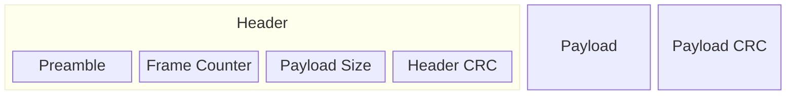

# C# Reference Implementation of Compact Frame Format

[](https://www.nuget.org/packages/CompactFrameFormat/)
[](https://github.com/CompactFrameFormat/cff-csharp/releases)
[](https://github.com/CompactFrameFormat/cff-csharp/actions/workflows/test.yml)
[](https://github.com/CompactFrameFormat/cff-csharp/blob/master/LICENSE)

## Overview

Compact Frame Format (CFF) is a way of delineating messages (called the _payload_) in a byte stream. It is designed specifically with Microcontrollers (MCUs) in mind, leading to the following design goals:

1. Take advantage of hardware acceleration like Direct Memory Access (DMA) controllers and the CRC peripherals available on most 32-bit MCUs. This precludes the use of delimiter-based packet boundaries that require the CPU to examine every byte.
2. Exploit the fact that modern serial links are already reliable. Universal Serial Bus (USB), Controller Area Network Bus (CANBus), and Bluetooth Low Energy (BLE), already detect and retransmit lost or corrupted packets. Other serial interfaces like Universal Asynchronous Receiver-Transmitters (UART), Serial Peripheral Interface (SPI), and Inter-Integrated Circuit (I2C) are often reliable in practice, with extremely low error rates when the wiring is short and clean. Therefore, the it's okay for error recovery to be expensive, so long as it's possible and the happy path is cheap. 
3. Easy to implement and debug. Firmware running on MCUs is not amenable to taking dependencies on 3rd party libraries, so the implementation should be small enough to fit comfortably in a single file, and simple enough that you wouldn't mind implementing it yourself if you had to.
4. Interoperate cleanly with binary serialization formats like [FlatBuffers](https://flatbuffers.dev/) and [CBOR](https://cbor.io/).

In CFF, a frame consists of a header, a payload, and a payload CRC.



The header consists of:

* A 2-byte preamble: [0xFA, 0xCE]. Note that this is better though of as an array of two bytes rather than an unsigned short (ushort) because it is transmitted as 0xFA, 0xCE (spelling face), whereas the ushort 0xFACE would be transmitted as 0xCE, 0xFA (spelling  nothing) in little endian.
* A little-endian ushort frame counter which increments for every frame sent and rolls over to 0 after 65,535 (2^16 - 1) frames have been sent.
* A little-endian ushort payload size, in bytes. This gives a theoretical maximum payload size of 65,535, though few MCU-based applications would want to support this. A protocol making use of CFF can enforce smaller maximum payload sizes if desired. Note that this excludes both the header and the payload CRC at the end. In other words, the _frame_ size is `header_size + payload_size + crc_size`.
* A 16-bit header CRC (see below for details) calculated over the preamble, frame counter, and payload size. This allows the receiver to validate the header and, crucially, the payload size without having to read in the entire frame, as would be the case if there were just one CRC, at the end, covering the entire frame. The problem with having a single CRC is that the if the payload size is corrupted in such a way that it is extremely large (65,535 in the pathological case) the reciever will not detect this until it reads that many bytes, calculates the CRC, and discovers that it doesn't match. Depending on the transmitter's data rate at the time of the error, it could take a long time to receive this many bytes, making the issue look like a dropped link. 

Both CRCs are calculated using CRC-16/CCITT-FALSE, with the following settings:

- Width: 16
- Polynomial: 0x1021
- Init: 0xFFFF
- RefIn/RefOut: false / false
- XorOut: 0x0000
- Check("123456789): 0x29B1l

## Usage

### Installation

Install the NuGet package:

```powershell
dotnet add package CompactFrameFormat
```

Or via Package Manager Console:

```powershell
Install-Package CompactFrameFormat
```

### API Reference

The CFF library provides three main methods for working with frames:

#### Creating Frames

Use `CreateFrame` to encode payload data into a CFF frame:

```csharp
using CompactFrameFormat;

// Create a frame with string payload
var payload = Encoding.UTF8.GetBytes("Hello, World!");
ushort frameCounter = 42;
byte[] frame = Cff.CreateFrame(payload, frameCounter);

// Frame now contains the complete CFF frame ready for transmission
Console.WriteLine($"Created frame of {frame.Length} bytes");
Console.WriteLine($"Frame bytes: {Convert.ToHexString(frame)}");
```

#### Parsing Single Frames

Use `TryParseFrame` to parse a single frame from byte data:

```csharp
using CompactFrameFormat;

// First create a frame to parse
var payload = Encoding.UTF8.GetBytes("Test Message");
ushort frameCounter = 123;
byte[] receivedData = Cff.CreateFrame(payload, frameCounter);

var result = Cff.TryParseFrame(receivedData, out CFrame parsedFrame, out int consumedBytes);

switch (result)
{
    case FrameParseResult.Success:
        Console.WriteLine($"Frame counter: {parsedFrame.FrameCounter}");
        Console.WriteLine($"Payload: {Encoding.UTF8.GetString(parsedFrame.Payload.Span)}");
        Console.WriteLine($"Consumed {consumedBytes} bytes");
        break;

    case FrameParseResult.InsufficientData:
        Console.WriteLine("Need more data to complete frame");
        break;

    case FrameParseResult.InvalidPreamble:
        Console.WriteLine("Invalid frame preamble");
        break;

    case FrameParseResult.InvalidHeaderCrc:
        Console.WriteLine("Header CRC validation failed");
        break;

    case FrameParseResult.InvalidPayloadCrc:
        Console.WriteLine("Payload CRC validation failed");
        break;
}
```

#### Finding Multiple Frames

Use `FindFrames` to locate and parse all valid frames in a data buffer:

```csharp
using CompactFrameFormat;

// Create multiple frames and combine them into a single buffer
var messages = new[] { "Frame 1", "Frame 2", "Frame 3" };
var buffer = new List<byte>();

// Create frames and add them to buffer
for (ushort i = 0; i < messages.Length; i++)
{
    var payload = Encoding.UTF8.GetBytes(messages[i]);
    var frame = Cff.CreateFrame(payload, i);
    buffer.AddRange(frame);
}

// Add some noise/corrupted data
buffer.AddRange(new byte[] { 0x00, 0x11, 0x22, 0x33 });

byte[] dataBuffer = buffer.ToArray();
Console.WriteLine($"Buffer contains {dataBuffer.Length} bytes total");

var frames = Cff.FindFrames(dataBuffer);

foreach ((CFrame frame, int position) in frames)
{
    Console.WriteLine($"Found frame at position {position}:");
    Console.WriteLine($"  Frame counter: {frame.FrameCounter}");
    Console.WriteLine($"  Payload size: {frame.PayloadSizeBytes} bytes");
    Console.WriteLine($"  Frame size: {frame.FrameSizeBytes} bytes");

    // Process payload
    var payloadText = Encoding.UTF8.GetString(frame.Payload.Span);
    Console.WriteLine($"  Payload: {payloadText}");
}
```

### Complete Example

```csharp
using System;
using System.Text;
using CompactFrameFormat;

class Program
{
    static void Main()
    {
        // Create and send frames
        var messages = new[] { "Hello", "World", "CFF" };
        var buffer = new byte[1024];
        int bufferPos = 0;

        Console.WriteLine("Creating frames:");
        for (ushort i = 0; i < messages.Length; i++)
        {
            var payload = Encoding.UTF8.GetBytes(messages[i]);
            var frame = Cff.CreateFrame(payload, i);

            Console.WriteLine($"  Frame {i}: {messages[i]} -> {frame.Length} bytes");

            // Simulate adding to receive buffer
            Array.Copy(frame, 0, buffer, bufferPos, frame.Length);
            bufferPos += frame.Length;
        }

        Console.WriteLine($"\nBuffer contains {bufferPos} bytes total");

        // Parse all frames from buffer
        var receivedFrames = Cff.FindFrames(buffer.AsMemory(0, bufferPos));

        Console.WriteLine("\nReceived frames:");
        foreach ((var frame, int pos) in receivedFrames)
        {
            var message = Encoding.UTF8.GetString(frame.Payload.Span);
            Console.WriteLine($"  Frame {frame.FrameCounter} at pos {pos}: {message}");
        }
    }
}
```

## Development

Clone the repository:
```powershell
git clone https://github.com/CompactFrameFormat/cff-csharp.git
cd cff-csharp
```

Build the Solution:
```powershell
cd cff-csharp
dotnet build
```

Run Tests:
```powershell
dotnet test
```
